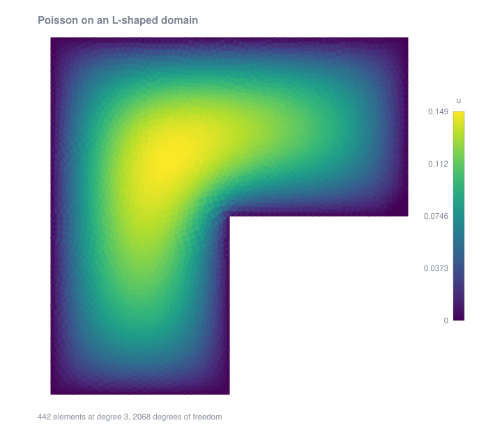
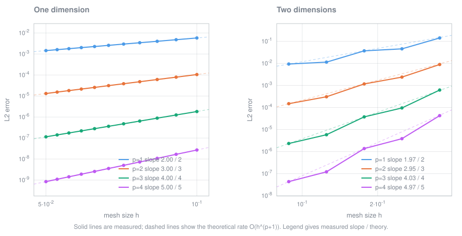

# hp-fem

[](https://github.com/dwulfse/hp-fem/actions/workflows/ci.yml)
[](LICENSE)

A higher-order finite element solver written from scratch in C++, for second order
elliptic boundary value problems in one and two dimensions.

Solves the Poisson problem

$$-\Delta u = f \quad \text{in } \Omega, \qquad u = 0 \quad \text{on } \partial\Omega,$$

and the semilinear problem

$$-\Delta u + \lambda u^{2q+1} = f,$$

the latter by a damped Picard iteration. Approximation uses a hierarchical modal basis
built from integrated Legendre polynomials, so the polynomial degree `p` is a parameter
rather than a rewrite. No finite element library is used; Eigen supplies only the sparse
Cholesky solve.



Above, $-\Delta u = 1$ on an L-shaped domain at degree 3. The reentrant corner drives a
singularity in the gradient, which is the classic motivation for `hp`-refinement.



Both dimensions attain the theoretical $O(h^{p+1})$ rate in the $L^2$ norm.

| `p` | theoretical rate | 1D measured | 2D measured |
| --- | --- | --- | --- |
| 1 | 2 | 2.00 | 1.97 |
| 2 | 3 | 3.00 | 2.95 |
| 3 | 4 | 4.00 | 4.03 |
| 4 | 5 | 5.00 | 4.97 |

Rates are least-squares fits of $\log \lVert u - u_h \rVert_{L^2}$ against $\log h$, with
`h` measured as the largest element diameter. On the finest mesh at `p = 4` the error is
$8.5 \times 10^{-10}$ in 1D and $4.4 \times 10^{-8}$ in 2D.

## Building

Requires a C++17 compiler, CMake 3.16+, and Eigen. Built and tested against Eigen 5.0.1;
no version constraint is imposed, and only the stable `Sparse` and `SparseCholesky`
interfaces are used.

```sh
cmake -B build -S .
cmake --build build
```

On Arch, Eigen comes from `pacman -S eigen`; on Debian or Ubuntu, `apt install libeigen3-dev`.

## Running

The binary is written into `main/` and must be run from there, since it reads mesh files
by relative path and writes its output to the working directory.

```sh
cd main
./FEM                          # 1D, degree 1, 4 elements
./FEM -d 2 -p 3 -m 6           # 2D on a 128 element mesh at degree 3
./FEM -d 2 -p 2 -m L.1         # 2D on the L shaped domain
./FEM -d 2 -p 3 --sweep        # 2D, plus the h-refinement study
./FEM -d 2 --semilinear --q 2  # semilinear, with a u^5 reaction term
./FEM --help                   # every option
```

Each run writes `solution.csv`, holding the solution sampled on a uniform grid alongside
the analytic solution where one is known. `--sweep` additionally writes `hp_error.csv`.

Numbered meshes `1` through `9` are successive refinements of the unit square; `L.1` is an
L-shaped domain, whose reentrant corner drives a singularity in the solution.

To regenerate the figures:

```sh
# convergence plot, from the sweep output in docs/
python3 scripts/plot_convergence.py

# solution field, from a run with --field
cd main && ./FEM -d 2 -p 3 -m L.1 --problem const --field && cd ..
python3 scripts/plot_solution.py main/field.csv docs/solution.svg \
    "Poisson on an L-shaped domain" "442 elements at degree 3, 2068 degrees of freedom"
```

`--field` writes a triangulation carrying the solution, sampled from the full basis rather
than from vertex coefficients alone, so the picture reflects the actual degree rather than
a piecewise linear reduction of it. Both scripts use only the standard library.

## Tests

```sh
ctest --test-dir build --output-on-failure
```

Catch2 is fetched by CMake at configure time; pass `-DFEM_BUILD_TESTS=OFF` to skip it.

The suite checks three layers. Quadrature rules are verified against exact integrals of
monomials, which is the defining property of a Gauss rule and pins the nodes and weights
down completely. The basis is checked structurally: vertex functions interpolate, edge
functions vanish on the edges they do not belong to, bubbles vanish on all three, each
edge mode reduces to the corresponding 1D Lobatto function along its own edge, and the
analytic gradients agree with finite differences. Finally the solver is run end to end
against problems with known solutions, asserting that the measured convergence rate
matches $p+1$.

## Method

**Reference elements.** The interval $[-1, 1]$ in 1D, and the triangle
$\lbrace (\xi, \eta) : -1 < \xi, \eta ; \ \xi + \eta < 0 \rbrace$ in 2D. Physical elements
are reached by an affine map, with gradients transformed by $D^{-T}$.

**Basis.** Hierarchical and modal rather than nodal, following Šolín et al. Each element
carries three vertex functions, $p - 1$ Lobatto edge modes per edge for $p \ge 2$, and
$(p-1)(p-2)/2$ interior bubbles for $p \ge 3$. Edge modes on a shared edge are
parameterised consistently by ordering the global vertex indices, with a sign correction
where the local ordering disagrees, so that the space stays conforming at odd degree.

**Quadrature.** Gauss–Legendre with $n_q = p + 1$ points, exact to degree $2n_q - 1$;
nodes above the tabulated cases are found by Newton iteration on the Legendre polynomials.
The triangle rule is a collapsed tensor product.

**Assembly and solution.** Local contributions are accumulated into a compressed sparse
row matrix whose sparsity pattern is precomputed from element connectivity. Dirichlet
conditions are imposed by zeroing the corresponding rows and columns and setting a unit
diagonal, which preserves symmetric positive definiteness, so the system is solved by the
sparse Cholesky factorisation `Eigen::SimplicialLLT`.

**Semilinear problems.** Given a relaxation parameter $0 < \alpha < 1$, the iteration

$$a(U_{n+1}, v) = (1 - \alpha)\, a(U_n, v) + \alpha \left( \int_\Omega f v \, dx - \lambda\, b(U_n; v) \right)$$

linearises the problem at each step, and the resulting system is solved directly.
Convergence is measured in the energy norm. This path is two-dimensional only.

## Layout

```
include/    class declarations
source/     implementations
main/       driver, meshes, and output
tests/      Catch2 test suite
scripts/    convergence plotting
docs/       figure and the data behind it
```

The design separates the mesh, the element, and the polynomial space:
`FE_Solution` drives the solve and owns an `FE_Mesh` (`FE_Mesh1D` or `FE_Mesh2D`), which
holds `Element` objects (`Element1D` or `Element2D`), each of which owns a
`PolynomialSpace`. Dimension-specific behaviour lives behind the abstract bases, so the
assembly and solve paths are shared.

## Meshes

Two-dimensional meshes are generated externally by
[Triangle](https://www.cs.cmu.edu/~quake/triangle.html) and read from its `.node` and
`.ele` files. They are selected by number in `main/main.cpp` — `"6"` loads
`main/domain.6.node` and `main/domain.6.ele`. Only three-node triangles are supported.
`main/domain.L.*` is an L-shaped domain.

## Background

Written for a fourth-year mathematics dissertation at the University of Nottingham
(G14DIS), supervised by Dr. Paul Houston. `dissertation_final_report.pdf` in this
repository gives the full derivation: function spaces and weak formulations in §3–4, the
implementation and every basis function in §5, and convergence studies in §6.

Principal references are Šolín, Segeth and Doležel, *Higher-Order Finite Element Methods*,
for the hierarchical triangular elements; Karniadakis and Sherwin, *Spectral/hp Element
Methods for Computational Fluid Dynamics*; and Ciarlet, *The Finite Element Method for
Elliptic Problems*, for the underlying theory.

## Scope

Dirichlet boundary conditions only. Meshes are read, not generated or adapted. The natural
extensions, in order of appeal, are Neumann and mixed conditions, `hp`-adaptivity driven by
a posteriori error estimates, and fully nonlinear problems.
